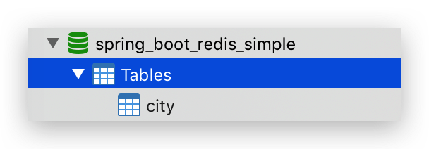
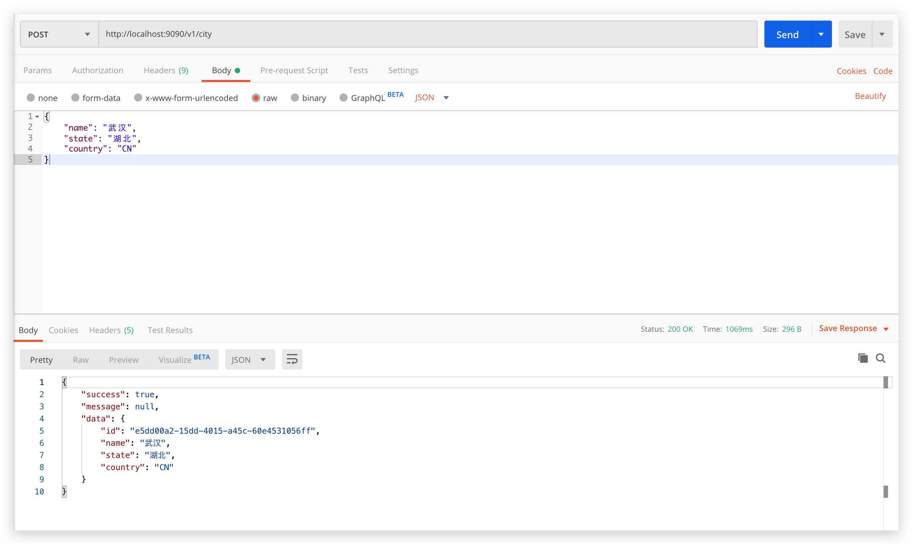
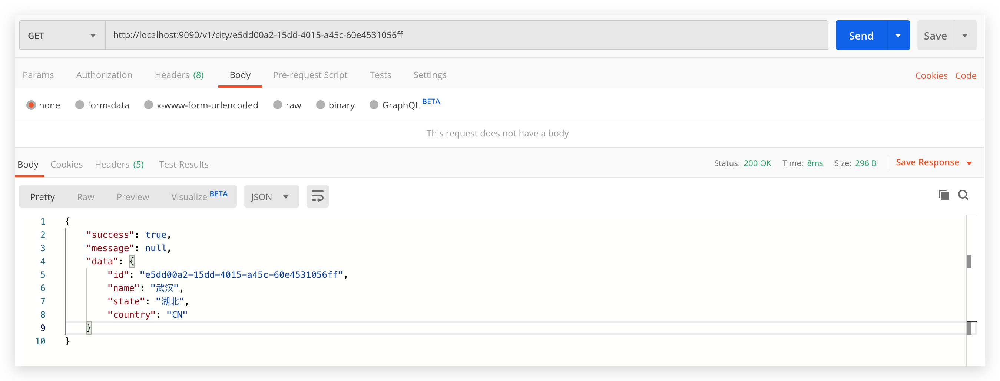

# spring-boot-simple

> 一个简单的操作数据库的 web 项目，并集成 redis 缓存

## 数据库

- 创建数据库 spring_boot_redis_simple
- 执行 SQL 创建表



```sql
CREATE TABLE city
(
  id      VARCHAR(50) PRIMARY KEY,
  name    VARCHAR(50),
  state   VARCHAR(20),
  country VARCHAR(20)
);
```

## 修改配置

修改 src/main/resources/application.yaml 文件中的数据库、缓存连接信息：

```yaml
spring:
  datasource:
    driver-class-name: com.mysql.jdbc.Driver
    url: jdbc:mysql://localhost:3306/spring_boot_redis_simple?serverTimezone=Asia/Shanghai&characterEncoding=utf-8
    username: root
    password: 123456
  redis:
    host: localhost
    port: 6379
    database: 1
    password:
    timeout: 3000
```

## 启动

- 运行 src/main/java/tk/fishfish/simple/Application.java 启动类的 main 方法
- 访问 http://localhost:9090/

## 接口

### 新增城市



### 主键查询城市



## 注意

接下来就需要你了解：

- redis 缓存

    如何使用注解快速对数据库操作进行缓存

快去完善这个例子吧～
