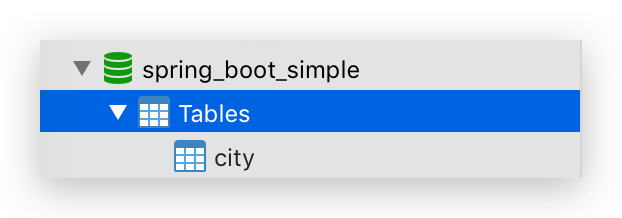
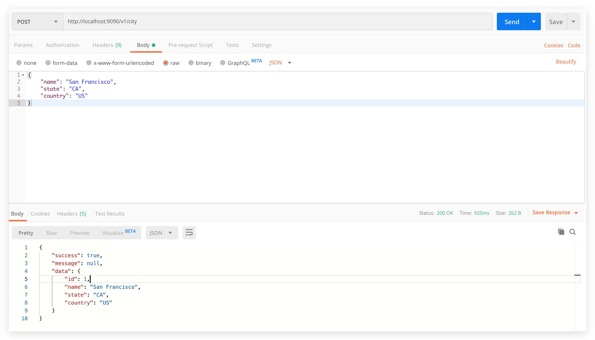
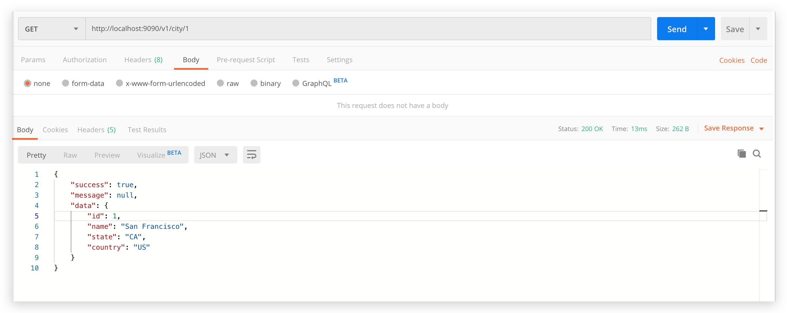

# spring-boot-simple

> 一个简单的操作数据库的 web 项目

## 数据库

- 创建数据库 spring_boot_simple
- 执行 SQL 创建表

```sql
CREATE TABLE city
(
  id      INT PRIMARY KEY auto_increment,
  name    VARCHAR(50),
  state   VARCHAR(20),
  country VARCHAR(20)
);
```



## 修改配置

修改 src/main/resources/application.yaml 文件中的数据库连接信息：

```yaml
spring:
  datasource:
    driver-class-name: com.mysql.jdbc.Driver
    url: jdbc:mysql://localhost:3306/spring_boot_simple?serverTimezone=Asia/Shanghai&characterEncoding=utf-8
    username: root
    password: 123456
```

## 启动

- 运行 src/main/java/tk/fishfish/simple/Application.java 启动类的 main 方法
- 访问 http://localhost:9090/

## 接口

### 新增城市



### 主键查询城市



## 注意

接下来就需要你了解：

- 数据库基本 SQL 语法

    数据库建表、字段，数据库的增删改查语法。

- mybatis 操作数据库

    mybatis 与 spring boot 集成后，如何完成对数据库的增删改查

- spring mvc 的参数绑定

    接收前端的参数，响应

快去完善这个例子吧～
